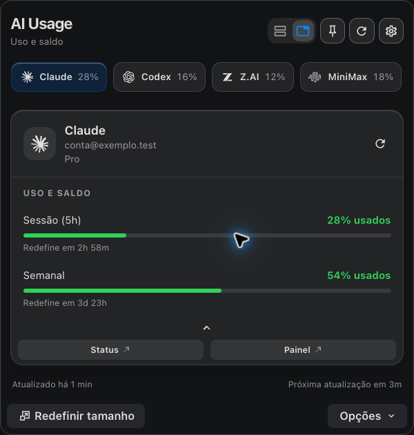
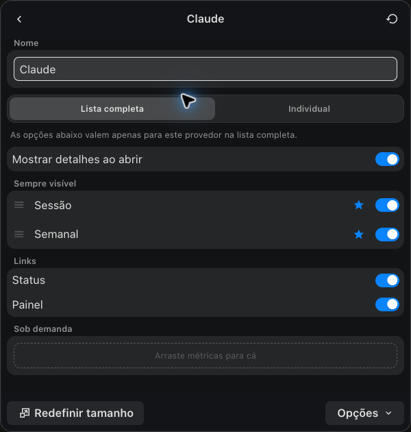
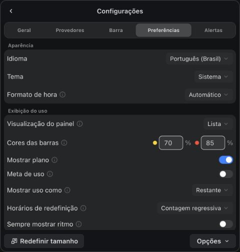

# AI Usage

Consumo dos seus serviços de IA na barra de menus do macOS. Veja quanto já
usou, o saldo disponível e quando cada limite será redefinido, sem sair do
aplicativo em que está trabalhando.

O AI Usage é um aplicativo visual para Macs com Apple Silicon. Você pode abrir
um painel com todas as contas ou consultar cada provedor pelo seu próprio item
na barra de menus. Os dados exibidos dependem do que cada serviço disponibiliza.

## Interface

### Várias contas na barra de menus

Consulte vários provedores sem abrir o painel. Esta captura mostra duas contas
Claude, duas Codex, Z.AI e MiniMax lado a lado, com consumos de 0% a 97%.
As estrelas identificam as contas em uso. As cores ajudam a localizar os limites
mais consumidos; os valores também podem aparecer sem cor.

Em **Configurações > Barra**, escolha quais provedores aparecem, a janela de
consumo e se deseja mostrar valores, somente o gráfico ou apenas a conta em uso.
Também é possível centralizar os itens da barra.

### Painel e métricas

| Consumo por provedor | Personalização visual |
| --- | --- |
|  |  |

Use abas para consultar um provedor por vez ou a visualização em lista para
acompanhar as contas no mesmo painel. A personalização permite escolher as
métricas visíveis e sua ordem.

### Aparência e opções de uso

Em **Configurações > Preferências**, altere o idioma, o tema, a visualização em
lista ou abas e os percentuais que ativam amarelo e vermelho. Escolha entre
consumo usado ou restante e entre contagem regressiva ou horário de redefinição.

A captura da barra é do aplicativo em uso e não contém nomes nem e-mails.
As imagens do painel e da personalização usam contas e consumo fictícios;
`conta@exemplo.test` é um endereço demonstrativo. A captura das preferências
foi feita sem contas conectadas. Nenhuma imagem contém credenciais.

## Começar a usar

1. Abra **AI Usage.app** pelo Finder.
2. Clique no ícone da barra de menus e use **Detectar provedores** nas
   configurações para encontrar sessões existentes no Mac.
3. Abra um provedor para consultar o uso. Em **Configurações**, escolha quais
   contas e métricas devem aparecer.

O [guia de primeiro uso](docs/getting-started.md) explica a instalação do bundle
local, as permissões e a inicialização automática. O uso diário é gráfico.

## O que o aplicativo oferece

- Acompanhe os provedores em lista ou abas, com atualização manual e periódica.
- Fixe o painel aberto, ajuste seu tamanho e personalize métricas, ordem e nomes.
- Configure os itens da barra, a janela de consumo e a exibição de valores.
- Ajuste aparência, idioma, atalho global, início de sessão e alertas.
- Alterne entre contas Claude e Codex já cadastradas e disponíveis no painel.

O clique direito abre as ações de cada item. O e-mail da conta aparece quando
a conexão autenticada fornece essa informação; os limites continuam visíveis
quando o serviço não disponibiliza a identidade.

A centralização dos provedores na barra exige permissão de Acessibilidade.
O aplicativo oferece uma orientação para autorizar a cópia que está em execução.

## Provedores e contas

O catálogo atual contém 24 provedores:

| Provedor | Provedor | Provedor |
| --- | --- | --- |
| Claude | Anthropic API | Codex |
| GitHub Copilot | Z.AI (GLM) | OpenRouter |
| DeepSeek | Kimi | Kilo |
| Novita | Moonshot | Grok |
| SuperGrok | Grok Bot | Antigravity |
| Cursor | MiniMax | Kiro |
| Nous Research | OpenCode Go | Command Code |
| Ollama Cloud | OrcaRouter | Model Studio |

Alguns conectores mostram cotas de assinatura; outros mostram saldo ou cobrança
de API. Os dados disponíveis e a forma de conexão variam por serviço. Consulte
[contas e provedores](docs/accounts.md) e as
[fontes dos dados](docs/vendor-endpoints.md) para entender cada conexão.

O monitoramento aproveita sessões e configurações existentes. Detectar um
provedor não faz login nele. A interface ainda não oferece cadastro completo
de contas nem um editor geral de chaves de API. Z.AI/GLM e MiniMax fornecem
consumo pela conexão atual, mas não o e-mail da conta. O aplicativo indica
essa ausência no painel.

## Plataforma e manutenção

O produto atual atende ao macOS com Apple Silicon. A aplicação combina uma
barra nativa em Rust com painéis locais em React, exibidos por WKWebView.
CLI/TUI, Windows e Linux foram retirados do produto.

Este repositório não distribui versões nem oferece atualização automática.
As instruções para preparar, compilar e assinar o aplicativo estão em
[DEVELOPMENT.md](DEVELOPMENT.md). A [documentação de testes](docs/testing.md)
separa os testes automatizados da validação do bundle instalado.

## Privacidade

Credenciais e configurações pessoais pertencem ao ambiente local e não devem
ser adicionadas ao repositório. Exemplos usam dados fictícios. A interface
recebe métricas e dados de apresentação; tokens e chaves ficam no backend.
Consulte os cuidados de diagnóstico em
[Solução de problemas](docs/troubleshooting.md).

## Documentação

| Preciso de... | Guia |
| --- | --- |
| Instalar e abrir o aplicativo | [Primeiro uso](docs/getting-started.md) |
| Ajustar painel, barra e alertas | [Configuração visual](docs/configuration.md) |
| Entender detecção e troca de contas | [Contas e provedores](docs/accounts.md) |
| Resolver problemas de exibição ou dados | [Solução de problemas](docs/troubleshooting.md) |
| Compilar ou modificar o projeto | [Desenvolvimento](DEVELOPMENT.md) |
| Entender os módulos | [Arquitetura](docs/architecture.md) |
| Consultar verificações e limitações | [Testes](docs/testing.md) |
| Consultar mudanças | [Changelog](CHANGELOG.md) |

O [índice da documentação](docs/README.md) separa uso, manutenção e histórico.
CLI/TUI, integrações Linux, host Windows e distribuição em gerenciadores de
pacotes não fazem parte do produto atual.

## Origem e licença

Este projeto deriva de ai-usagebar, de AkitaOnRails. A
[licença MIT original](LICENSE) e seus avisos de autoria permanecem preservados.
O [histórico original](docs/history/CHANGELOG.original.md) registra as versões
anteriores e suas plataformas; ele não descreve o escopo atual.
